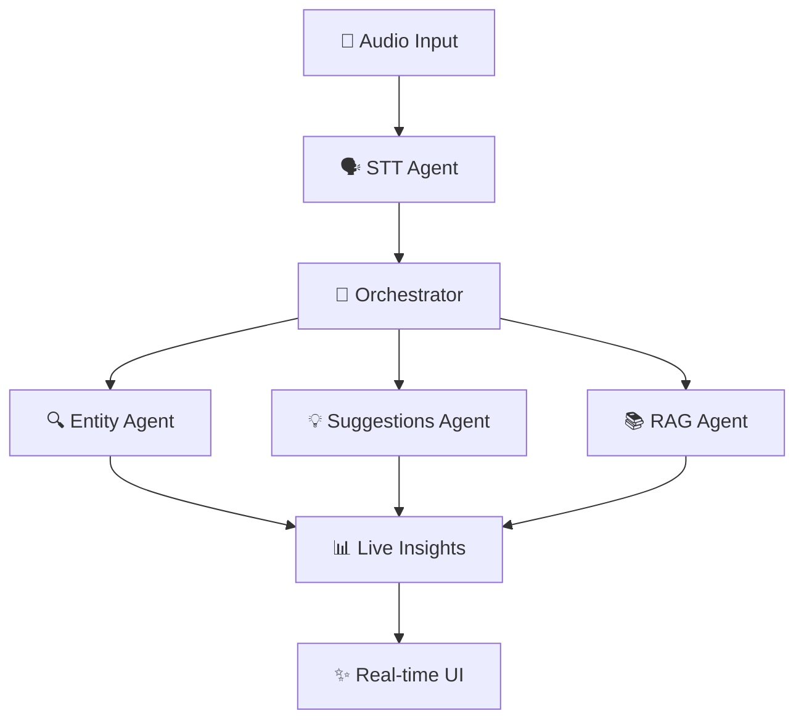

# 🤖 Agentic Meeting Studio

  

 
 

---

## ✨ About

⚡ **Agentic Meeting Studio** was built at **IIT Kanpur** during a  
⏱️ **12-hour hackathon organized by OOSC Open Source**.  

💡 It transforms **ordinary meetings → actionable insights** in real-time, powered by **multi-agent AI**.

---

## 🚀 Key Features

<table>
<tr>
<td width="50%">

- 🎤 **Live Speech-to-Text**  
- 🤖 **AI Multi-Agent System**  
- 🔍 **Entity Extraction**  
- 💡 **Smart Recommendations**  

</td>
<td width="50%">

- 📊 **Meeting Summaries**  
- ⚡ **Streaming Insights (char-by-char)**  
- 🔐 **Secure Firebase Auth**  
- 🎨 **Modern Glassmorphism UI**  

</td>
</tr>
</table>

---

## 🏗️ Architecture

## 🛠️ Tech Stack

| Frontend | Backend | Infra | AI |
|:--------:|:-------:|:-----:|:--:|
| ⚛️ React 18 | 🟩 Node.js | 🔥 Firebase | 🤯 OpenAI GPT |
| 🎨 Tailwind | 🚀 Express | ☁️ Hosting | 🧠 Custom Agents |

## 🎯 Quick Demo Flow

1️⃣ **Start Meeting** → Capture Audio  
2️⃣ **Watch Live Transcription** (instant)  
3️⃣ **Get AI Insights + Suggestions** in Real-time  
4️⃣ **End Meeting** → Auto Summary Generated  

## 🌟 Why It Stands Out

💎 **Built in just 12 hours** at IIT Kanpur Hackathon (OOSC Open Source)  
⚡ **Streaming AI output** (character-by-character, like ChatGPT)  
🎨 **Interactive Glassmorphism UI** with smooth animations  
🤝 **Designed for real-world adoption**  

## 👨‍💻 Author

**Ronit**

## 🙏 Acknowledgments

- **IIT Kanpur & OOSC Open Source** for the hackathon
- **OpenAI + Firebase** for powering the stack
- **Hackathon mentors** for their invaluable guidance

## 🔥 Turning Coffee → Code → AI Magic in 12 Hours 🔥

