# 🤖 Agentic Meeting Studio

<div align="center">

[](https://agentic-meeting-studio.web.app/)


### *Intelligent Meeting Assistant with Real-time AI Insights*

<p align="center">
  
</p>

[](https://reactjs.org/)
[](https://www.typescriptlang.org/)
[](https://firebase.google.com/)
[](https://tailwindcss.com/)
[](https://vitejs.dev/)


</div>

## ✨ What Makes It Special

<table>
<tr>
<td width="50%">

### 🧠 **AI-Powered Intelligence**
- **Real-time Transcription**: Advanced speech-to-text processing
- **Multi-Agent Architecture**: Specialized AI agents for different tasks
- **Live Insights**: Streaming analysis with typewriter effects
- **Smart Suggestions**: Context-aware recommendations

</td>
<td width="50%">

### 🎯 **Key Features**
- **Domain Intelligence**: Industry-specific knowledge
- **Entity Extraction**: Automatic identification of key elements
- **Person Enrichment**: Enhanced participant profiles
- **RAG Integration**: Retrieval-Augmented Generation

</td>
</tr>
</table>

## 🚀 Live Demo

<div align="center">

### 🌟 **Experience the Future of Meetings**

<a href="https://agentic-meeting-studio.web.app/" target="_blank">
  
  <br>
  <strong>🔗 https://agentic-meeting-studio.web.app/</strong>
</a>

</div>

## 🏗️ Architecture Overview

```mermaid
graph TB
    A[🎤 Audio Input] --> B[🗣️ Speech-to-Text Agent]
    B --> C[📊 Orchestrator]
    C --> D[🧠 Domain Intelligence Agent]
    C --> E[🔍 Entity Extraction Agent]
    C --> F[👤 Person Enrichment Agent]
    C --> G[📝 Suggestion Generator Agent]
    C --> H[🔗 Retriever RAG Agent]
    C --> I[📈 Ranking Contextualizer Agent]
    D --> J[💡 Live Insights Panel]
    E --> J
    F --> J
    G --> J
    H --> J
    I --> J
    J --> K[✨ Real-time UI Updates]
```



## 🛠️ Technology Stack

<div align="center">

| Frontend | Backend | Database | Deployment | AI/ML |
|:--------:|:-------:|:--------:|:----------:|:-----:|
|  |  |  |  |  |
| React 18 | Node.js | Firestore | Firebase | OpenAI GPT |
| TypeScript | Express | Real-time DB | Hosting | Custom Agents |

</div>

## 🎨 Features Showcase

<details>
<summary>🎭 <strong>Interactive UI Components</strong></summary>

- **Glass Morphism Design**: Modern, translucent interface elements
- **Animated Backgrounds**: Dynamic particle systems and gradients
- **Real-time Visualizations**: Live data streaming with smooth animations
- **Responsive Layout**: Seamless experience across all devices

</details>

<details>
<summary>🤖 <strong>AI Agent System</strong></summary>

- **Speech-to-Text Agent**: High-accuracy voice recognition
- **Domain Intelligence Agent**: Industry-specific knowledge processing
- **Entity Extraction Agent**: Automatic identification of people, places, concepts
- **Person Enrichment Agent**: Enhanced participant information and context
- **Suggestion Generator Agent**: Real-time actionable recommendations
- **Retriever RAG Agent**: Knowledge base integration and retrieval
- **Ranking Contextualizer Agent**: Priority-based insight organization

</details>

<details>
<summary>🔥 <strong>Real-time Features</strong></summary>

- **Live Transcription**: Instant speech-to-text conversion
- **Streaming Insights**: Character-by-character AI analysis
- **Dynamic Suggestions**: Context-aware recommendations
- **Real-time Collaboration**: Multi-user meeting support

</details>

## 🚀 Getting Started

### Prerequisites

 **Node.js** (v18 or higher)  
 **Firebase Account**  
 **OpenAI API Key**

### Installation

```bash
# Clone the repository
git clone https://github.com/Ronit-bby/agentic-live-sales.git

# Navigate to project directory
cd agentic-live-sales

# Install dependencies
npm install

# Set up environment variables
cp .env.example .env.local
# Add your Firebase and OpenAI configurations

# Start development server
npm run dev
```

<div align="center">

</div>

## 🎯 Usage

1. **🎤 Start Recording**: Click the record button to begin capturing audio
2. **👀 Watch Live Transcription**: See real-time speech-to-text conversion
3. **🧠 View AI Insights**: Monitor intelligent analysis as it streams in
4. **💡 Get Suggestions**: Receive contextual recommendations during the meeting
5. **📊 Review Analytics**: Access comprehensive meeting insights and summaries

## 🌟 Key Highlights

<div align="center">

| Feature | Description | Status |
|---------|-------------|--------|
| 🎯 **Real-time Processing** | Live audio transcription and analysis | ✅ Active |
| 🤖 **Multi-Agent AI** | Specialized agents for different tasks | ✅ Active |
| 🔄 **Streaming Insights** | Character-by-character AI responses | ✅ Active |
| 🎨 **Modern UI/UX** | Glass morphism and smooth animations | ✅ Active |
| 🔐 **Secure Authentication** | Firebase-based user management | ✅ Active |
| 📱 **Responsive Design** | Cross-platform compatibility | ✅ Active |

</div>

## 🤝 Contributing

 **We welcome contributions!**

1. Fork the repository
2. Create your feature branch (`git checkout -b feature/AmazingFeature`)
3. Commit your changes (`git commit -m 'Add some AmazingFeature'`)
4. Push to the branch (`git push origin feature/AmazingFeature`)
5. Open a Pull Request

## 📄 License

This project is licensed under the MIT License - see the [LICENSE](LICENSE) file for details.

## 👨‍💻 Author

<div align="center">

**Ronit** 

[](https://github.com/Ronit-bby)
[](https://linkedin.com/in/ronit-bby)

</div>

## 🙏 Acknowledgments

- **OpenAI** for providing powerful AI capabilities
- **Firebase** for robust backend infrastructure
- **React** community for amazing components and tools
- **Tailwind CSS** for beautiful styling utilities

<div align="center">

### 🌟 **Star this repository if you found it helpful!** 🌟


**Made with ❤️ and lots of ☕**

</div>